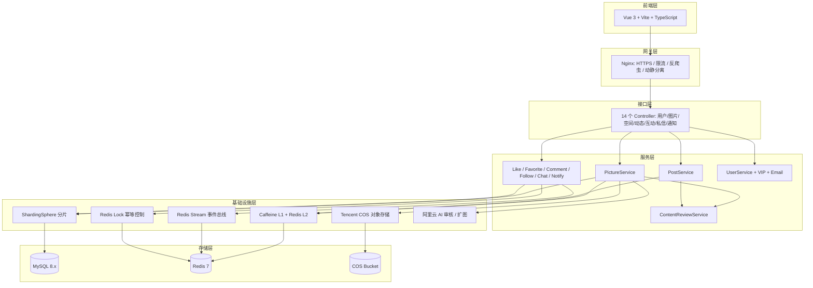
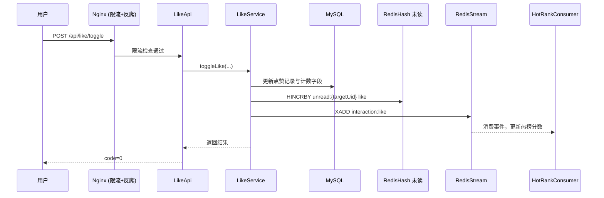

<div align="center">
# 栖图 Nestpic

**作品的栖息之地**

一款面向创作者的图片平台，打通图片管理、团队空间与社交互动。


</div>

---

## 目录

- [项目亮点](#项目亮点)
- [项目结构](#项目结构)
- [核心功能](#核心功能)
- [技术栈](#技术栈)
- [系统架构](#系统架构)
- [快速开始](#快速开始)
- [接口与联调](#接口与联调)
- [性能与可靠性](#性能与可靠性)
- [部署说明](#部署说明)
- [常见问题](#常见问题)
- [路线图](#路线图)

---

## 项目亮点

- **一体化体验**：同一套系统内完成上传、检索、分享、关注、评论、私信与动态发布。
- **功能闭环完整**：从作品沉淀到社区传播，覆盖创作到互动全流程。
- **AI 增强**：集成阿里云 AI 实现内容审核、图像智能扩图。
- **工程化能力明确**：两级缓存、事件解耦、分库分表、幂等控制、多层限流防护。
- **生产级运维**：k6 压测基线、灰度发布手册、CDN 加固清单。
- **上手成本低**：前后端分离，提供完整 SQL 初始化脚本与本地启动流程。

> 适用场景：个人创作者作品管理、小团队素材协作、带互动能力的社区型图库。

---

## 项目结构

```text
picture/
├─ README.md
├─ docs/
│  ├─ graduation_thesis_framework.md        # 毕业论文大纲
│  ├─ security_rate_limit_and_anti_crawler.md
│  └─ images/                               # 架构图、功能图
├─ picture-backend/                         # Spring Boot 后端
│  ├─ pom.xml
│  ├─ sql/                                  # 数据库初始化脚本
│  │  ├─ create_table.sql                   # 核心表 DDL
│  │  ├─ picture.sql / space.sql            # 图片与空间业务 DDL
│  │  ├─ feature_social.sql                 # 社交互动 DDL
│  │  ├─ feature_post.sql                   # 社区动态 DDL
│  │  ├─ feature_post_privacy.sql           # 动态隐私 DDL
│  │  └─ migration_add_email.sql            # 邮箱迁移 DDL
│  ├─ ops/                                  # 运维
│  │  ├─ nginx/                             # Nginx 配置 + 限流配置
│  │  ├─ loadtest/                          # k6 压测脚本 (读/写/WS/攻击)
│  │  ├─ release/                           # 上线回滚手册 + 环境变量模板
│  │  └─ cdn/                               # CDN 加固清单
│  ├─ httpTest/                             # HTTP 请求测试脚本
│  └─ src/main/java/com/xcw/picturebackend/
│     ├─ controller/                        # 14 个 Controller
│     ├─ service/                           # 业务逻辑层
│     ├─ mapper/                            # MyBatis Plus 数据访问
│     ├─ model/                             # Entity / DTO / VO / Enum
│     ├─ manager/                           # 基础设施管理器 (COS, AI, Sharding)
│     ├─ security/                          # 签名校验、反爬虫
│     ├─ config/                            # Spring 配置
│     ├─ aop/                               # 切面 (日志、权限)
│     ├─ api/                               # 第三方 API 集成
│     ├─ common/                            # 公共响应与工具
│     ├─ constant/                          # 常量
│     ├─ exception/                         # 全局异常处理
│     ├─ job/                               # 定时任务
│     └─ utils/                             # 工具类
└─ picture-frontend/                        # Vue 3 + TypeScript 前端
   ├─ package.json
   ├─ openapi.config.js                     # OpenAPI 代码生成配置
   ├─ index.html
   └─ src/
      ├─ main.ts                            # 入口
      ├─ App.vue
      ├─ router/index.ts                    # 路由 (~25 条)
      ├─ pages/                             # 页面组件 (~20 个)
      ├─ components/                        # 通用与业务组件 (~30 个)
      ├─ api/                               # API 请求客户端
      ├─ stores/                            # Pinia 状态管理
      ├─ access/                            # 权限控制
      ├─ layouts/                           # 布局组件
      ├─ utils/                             # 工具函数
      └─ constants/                         # 常量
```

---

## 核心功能

### 1) 图片与空间

- 图片上传：单图上传、批量抓取、URL 上传，直传腾讯云 COS + CDN 加速。
- 图片管理：标签、分类、检索、详情展示、收藏与分享。
- 智能搜索：以图搜图（百度 API）、按颜色搜图（颜色相似度算法）。
- AI 扩图：集成阿里云 OutPainting API，智能扩展图像边界。
- 空间体系：个人空间 + 团队协作空间，含成员管理与容量统计。
- 空间级别：普通版 / 专业版 / 旗舰版，按套餐限制容量与数量。
- 内容审核：上传图片自动进入审核流程，支持通过 / 拒绝。
- 数据分析：空间使用量、分类分布、标签词云、成员活跃度等看板。
- 热度排行：基于定时任务计算图片热榜。


### 2) 账号与社交

- 用户体系：注册、登录（Sa-Token）、个人资料编辑、头像上传。
- 会员系统：VIP 兑换码机制，到期自动降级。
- 账号安全：邮箱绑定、忘记密码、图形验证码、密码修改。
- 关系网络：关注 / 粉丝、互关检测、隐私开关（允许私聊 / 关注 / 展示列表）。
- 社交互动：点赞、收藏、评论（两级评论结构，支持回复）。
- 消息触达：互动消息聚合通知，未读计数基于 Redis Hash 统一管理。
- 在线状态：基于 Redis TTL 心跳维护在线态。


### 3) 社区与动态

- 动态发布：图文帖子（1~9 张图），支持编辑与删除。
- 可见性控制：公开 / 仅粉丝可见 / 仅自己可见。
- Feed 流：社区广场浏览，支持热榜排序。
- 内容审核：帖子发布后进入审核流程。
- 互动闭环：帖子支持点赞、收藏、评论，互动计入热度。


### 4) 私信与消息中心

- 私信会话：文本 / 图片消息，消息状态追踪，客户端去重。
- 消息中心：点赞、评论、收藏、关注、系统通知统一聚合。
- 未读计数：Redis Hash 聚合多类型未读，支持按类型查询。
- 事件驱动：Redis Stream 异步消费互动事件，更新热榜与未读。


---

## 技术栈

| 层级 | 技术 | 说明 |
|------|------|------|
| **后端框架** | Spring Boot 2.7.6, Java 17 | RESTful API |
| **ORM** | MyBatis Plus 3.5.12 | 数据访问与分页 |
| **数据库** | MySQL 8.x | 主数据存储 |
| **缓存** | Caffeine (L1) + Redis 7 (L2) | 两级缓存架构 |
| **会话** | Spring Session + Redis | 分布式会话 |
| **认证鉴权** | Sa-Token 1.39.0 | 登录态 + 权限控制 |
| **API 文档** | Knife4j 4.4.0 (Swagger) | 接口文档与调试 |
| **对象存储** | 腾讯云 COS | 图片存储，CDN 加速 |
| **AI 集成** | 阿里云 AI | 内容审核 + 图像扩图 |
| **分片** | Apache ShardingSphere JDBC 5.2.0 | 分库分表 |
| **WebSocket** | Spring WebSocket + LMAX Disruptor | 实时消息推送 |
| **事件流** | Redis Stream | 异步事件消费 |
| **邮件** | Spring Mail (阿里云 SMTP) | 邮箱验证与密码重置 |
| **工具库** | Hutool 5.8, Lombok, Jsoup, Commons IO | 通用工具 |
| **前端框架** | Vue 3.5, TypeScript 5.8 | SPA |
| **构建工具** | Vite 6 | 开发与打包 |
| **UI 框架** | Ant Design Vue 4 | 组件库 |
| **状态管理** | Pinia 3 | 全局状态 |
| **路由** | Vue Router 4 | 前端路由 |
| **图表** | ECharts 5 + vue-echarts + wordcloud | 数据可视化 |
| **3D 渲染** | Three.js | 图片 3D 预览 |
| **代码生成** | @umijs/openapi | 从 OpenAPI 生成请求客户端 |
| **压测** | k6 | 读写 / WebSocket / 攻击模拟 |

---

## 系统架构

### 总体架构图



### 关键链路（点赞事件驱动）



---

## 快速开始

### 环境要求

| 组件 | 建议版本 |
|------|----------|
| JDK | 17+ |
| Maven | 3.8+ |
| Node.js | 18+ |
| MySQL | 8.0+ |
| Redis | 7.0+ |

### 1. 克隆项目

```bash
git clone https://github.com/EddieCww/picture.git
cd picture
```

### 2. 初始化数据库

```bash
# 依次导入 DDL（create_table.sql 需最先执行）
mysql -u root -p picture < picture-backend/sql/create_table.sql
mysql -u root -p picture < picture-backend/sql/picture.sql
mysql -u root -p picture < picture-backend/sql/space.sql
mysql -u root -p picture < picture-backend/sql/feature_social.sql
mysql -u root -p picture < picture-backend/sql/feature_post.sql
mysql -u root -p picture < picture-backend/sql/feature_post_privacy.sql
mysql -u root -p picture < picture-backend/sql/migration_add_email.sql
```

### 3. 配置本地环境

编辑 `picture-backend/src/main/resources/application-local.yml`：

- COS：`secretId`、`secretKey`、`bucket`、`region`
- 阿里云 AI：`secretId`、`apiKey`（审核 + 扩图）
- 签名密钥：`security.signature.secret`
- MySQL / Redis 连接信息

### 4. 启动后端

```bash
cd picture-backend
mvn clean package -DskipTests
java -jar target/picture-backend-0.0.1-SNAPSHOT.jar --spring.profiles.active=local
```

- 端口：`8123`
- 接口前缀：`/api`
- API 文档：`http://localhost:8123/api/doc.html`

### 5. 启动前端

```bash
cd picture-frontend
npm install
npm run dev
```

前端默认地址：`http://localhost:5173`

---

## 接口与联调

- Knife4j 文档：`http://localhost:8123/api/doc.html`
- OpenAPI JSON：`http://localhost:8123/api/v2/api-docs`
- 前端 SDK 生成：

```bash
cd picture-frontend
npm run openapi
```

`openapi.config.js` 默认基于本地后端文档地址生成接口调用代码到 `src/api/`。

---

## 性能与可靠性

- **两级缓存**：Caffeine (L1 本地缓存) + Redis (L2 分布式缓存)，降低热点查询延迟。
- **分库分表**：ShardingSphere JDBC 对图片表、点赞表等高频写入表做分片，支撑数据增长。
- **事件解耦**：Redis Stream 承担互动事件异步消费，点赞、收藏等操作不阻塞主链路。
- **幂等控制**：关键写接口使用 Redis 锁 + 业务幂等键，防止重复提交。
- **未读聚合**：Redis Hash 聚合多类型未读计数，O(1) 查询。
- **多层限流**：Nginx limit_req (API + WebSocket) + Redis ZSET 滑动窗口限流。
- **安全防护**：HMAC 防篡改签名、图形验证码、反爬虫 UA 过滤、内容 AI 审核。

详情见：`docs/security_rate_limit_and_anti_crawler.md`。

---

## 部署说明

### 生产环境拓扑

| 组件 | 说明 |
|------|------|
| **域名** | `picture.xucanwei.xyz` (HTTPS) |
| **CDN** | 腾讯云 CDN，加速 COS 静态资源 |
| **Nginx** | SSL 终止、动静分离、限流、反爬虫、WebSocket 代理 |
| **后端** | JAR 运行在 `8123` 端口 |
| **前端** | Nginx 静态托管 `/www/wwwroot/picture-frontend` |
| **数据库** | 生产 MySQL 8.x + Redis 7 |

### 运维文档

- Nginx 配置：`ops/nginx/www.xucanwei.xyz.conf`
- 限流配置：`ops/nginx/global-rate-limit.conf`
- 上线手册：`ops/release/production-cutover-runbook.md`
- 压测基线：`ops/loadtest/README.md`
- CDN 加固：`ops/cdn/tencent-cloud-hardening-checklist.md`

---

## 常见问题

### Q1：前端请求 404 或跨域失败

- 确认后端已启动在 `8123` 端口，且接口前缀为 `/api`。
- 检查 Vite 代理配置或 Nginx 反代配置是否指向正确的后端地址。

### Q2：`npm run openapi` 生成失败

- 确认 `http://localhost:8123/api/v2/api-docs` 可访问。
- 检查本地网络与代理设置是否影响回环访问。

### Q3：上传失败或文件过大

- 检查后端 `spring.servlet.multipart.max-file-size` 配置。
- 确认 COS 密钥、存储桶、区域配置正确。

### Q4：消息未读计数异常

- 检查 Redis 是否可连接。
- 排查 Redis Stream 消费链路：Group 是否存在、是否有 pending 消息堆积。

### Q5：后端启动报 COS / AI 连接异常

- 本地开发时需激活 `local` profile，并填写 `application-local.yml` 中的第三方服务密钥。
- 若无需 COS 或 AI 功能，可暂时注释对应配置项。

---

## 路线图

- 图像检索增强：语义检索与相似图召回。
- 消息推送实时化：WebSocket 实时推送代替轮询。
- 可观测性完善：接入监控告警与链路追踪。
- 协作体验优化：空间角色权限粒度细化。
- 国际化支持。

---

## License

MIT © [EddieCww](https://github.com/EddieCww)
